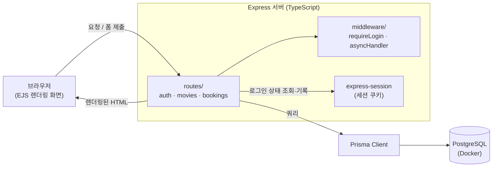
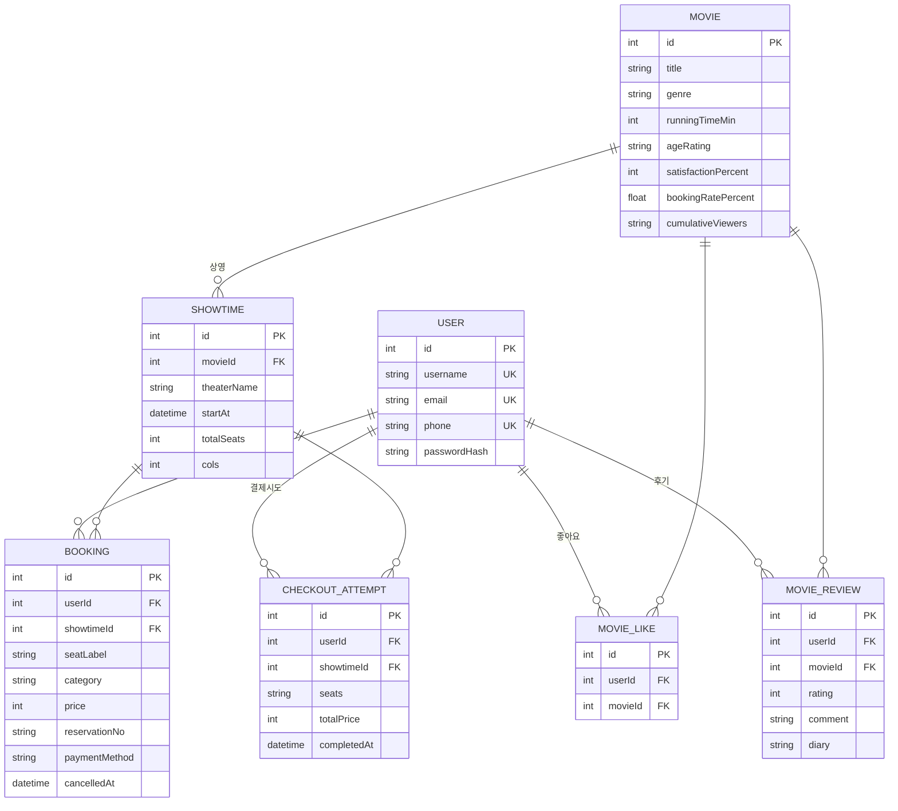

# GCinema 영화 티켓 예매 시스템

본 Repository는 직무 과제 제출용으로, 채용이 끝나면 Private으로 전환하겠습니다.

GitHub: https://github.com/codingiswine/GCinema

개발 직군 과제 프로젝트로, 가상의 영화관 "GCinema"를 배경으로, 회원가입부터 좌석 예매까지 한 번에 시연할 수 있는 서버 렌더링 웹앱으로 구현했습니다.

과제 지침에 최대한 부합하게 과제를 진행했습니다.
과도한 기능 구현은 지양했고, 실제 서비스 수준의 완성도로 만들었습니다.

## 실행 방법

### 1. 사전 준비
- Node.js 18+ (개발/테스트: Node 24)
- Docker (PostgreSQL 실행용)

### 2. 설치 및 DB 기동
```bash
npm install
cp .env.example .env
docker compose up -d          # PostgreSQL 컨테이너 기동
npx prisma migrate dev        # 스키마 마이그레이션
npx prisma db seed            # 영화/상영시간 더미 데이터 시딩
```
`git clone` 후 위 명령만 그대로 실행하면 별도 설정 없이 동일하게 재현되도록 설계했습니다 — `.env.example`이 `docker-compose.yml`의 DB 계정과 그대로 맞물려 있고, 외부 API·서비스에 대한 런타임 의존성이 없어(영화 데이터도 전부 시드로 생성) 운영체제나 로컬 환경에 상관없이 동작합니다.

### 3. 서버 실행
```bash
npm run dev        # 개발 모드 (파일 변경 시 자동 재시작)
# 또는
npm start          # ts-node로 바로 실행
```
브라우저에서 http://localhost:3000 접속 (영화 목록으로 리다이렉트됩니다).

시드는 **데모 계정 `gcinema` / `!gcinema12`** 를 함께 만듭니다. 마이페이지의 "내가 본 영화"·"나의 영화일기"는 상영이 끝난 예매가 있어야 내용이 보이는데 지난 회차는 예매 자체가 막혀 있어, 새로 가입하면 두 탭이 비어 보입니다. 이 계정에는 관람 이력 2건과 평점·한줄평이 미리 들어 있어 바로 확인할 수 있습니다.

### 4. 테스트
```bash
npm test           # Jest + supertest, 실제 DB에 대해 핵심 플로우 검증 (65개)
npm run build       # tsc 타입 체크
```

## 요구 기능 구현 내용

과제 지침의 "요구 기능" 1~3번을 각각 어떻게 구현했는지입니다.

**1. 회원 기능**
- **회원가입** (`GET/POST /signup`, `signup.ejs`): 아이디(문자 포함 5자 이상, 실시간 중복확인)·이메일(형식+중복)·휴대전화번호(형식+중복)·비밀번호(영문+숫자+특수문자 8자 이상)를 서버·클라이언트 양쪽에서 검증하고, `bcrypt`로 해시해 저장합니다.
- **로그인** (`GET/POST /login`): 세션 쿠키 기반 인증이며, 로그인 성공 시 `session.regenerate()`로 세션 ID를 재발급해 세션 고정 공격을 막고, 로그인 실패가 계정당 8회 쌓이면 15초간 잠그는 무차별 대입 방어를 둡니다.

**2. 영화 / 상영 정보**
- **영화 목록 조회** (`GET /movies`, `movies.ejs`): 박스오피스 순위·포스터·연령등급·만족도·예매율·누적 관객수를 카드로 보여줍니다.
- **상영 시간 목록 조회** (`GET /movies/:id?date=YYYY-MM-DD`, `movie.ejs`): 영화별 날짜(오늘부터 7일)·상영관·잔여좌석을 한 화면에서 전환하며 조회할 수 있고, 영화·상영 데이터는 과제 안내대로 `prisma/seed.ts`의 임의 데이터로 구성했습니다.

**3. 좌석 예매**
- **좌석 선택 및 예매** (`GET /showtimes/:id` → `GET /showtimes/:id/checkout` → `POST /showtimes/:id/pay`): 상영관 그리드에서 빈 좌석을 자유롭게 선택하고, 결제 페이지를 거쳐 예매를 확정합니다. 동시에 같은 좌석을 예매해도 DB 부분 유니크 인덱스가 하나만 성공시키고 나머지는 409로 막습니다.
- **예매 내역 조회** (`GET /bookings`, `bookings.ejs`): 마이페이지 "결제내역" 탭에서 본인 예매 목록(예매번호·좌석·금액)을 확인하고, 예매 취소도 여기서 처리합니다.

이 세 그룹 각각의 세부 설계 근거는 아래 "설계 의도"에, 필수 범위를 넘는 추가 기능은 "(선택) 추가 구현 내용"에 따로 정리했습니다.

## 시연 순서
1. `/signup`에서 아이디(중복확인 필수) · 이메일 · 휴대전화번호 · 비밀번호로 회원가입
2. `/login`에서 아이디/비밀번호로 로그인
3. 영화 목록(포스터 카드) → 예매하기 → 상영시간 선택 (포스터 클릭 시 상세 페이지에서도 예매 가능)
4. 관람인원선택에서 성인/청소년/경로/우대 인원수 선택 (경로·우대는 최초 선택 시 1회 안내 팝업 확인 필요)
5. 좌석 그리드에서 선택한 인원 수만큼 빈 좌석을 자유롭게 클릭(짝 강제 없음) → 결제하기(연령등급·입장 유의사항 확인 팝업)
6. 결제 페이지에서 예매 정보·금액 명세 확인 → 결제수단 선택 → **취소/환불 정책 동의(필수)** → 결제하기
7. 예매 완료 화면에서 예매번호 확인 → `/bookings`(마이페이지) "결제내역 > 예매내역"에서 확인, 예매 취소 버튼으로 취소하면 "취소내역" 탭으로 옮겨감
8. (`gcinema`로 로그인 시) 마이페이지 "내가 본 영화"에서 관람한 영화에 5점 만점 평점·한 줄 평을 남기고, "나의 영화일기"의 일기쓰기 버튼으로 감상을 기록

## 아키텍처

> 아래 아키텍처·ERD 다이어그램은 mermaid 코드블록이라 렌더링 환경에 따라 그림 대신 코드로 보일 수 있습니다. 그림으로 보이지 않는다면 [GitHub 저장소](https://github.com/codingiswine/GCinema)에서 확인해주세요.

브라우저와 서버 사이에 별도 API 레이어나 클라이언트 상태 관리가 없는 단순한 3계층 구조입니다. 모든 화면은 서버에서 EJS로 렌더링된 완성된 HTML로 내려가고, 로그인 상태는 세션 쿠키 하나로만 유지됩니다.



## ERD

`prisma/schema.prisma`의 7개 모델과 관계입니다. `Seat` 테이블이 없는 이유(좌석 상태를 `Showtime.totalSeats`/`cols` + `Booking` 조회로 계산)는 아래 "설계 의도"에 있습니다.



## 프로젝트 구조
```
prisma/
  schema.prisma      # User / Movie / Showtime / Booking / MovieLike / CheckoutAttempt / MovieReview
  migrations/        # 마이그레이션 10개 (부분 유니크 인덱스는 손으로 작성한 SQL 포함)
  seed.ts            # 영화 4편 · 관별 좌석수 · 7일치 상영시간표 · 회차별 좌석 10% 랜덤 선점
src/
  app.ts             # express 앱 조립 (세션, 뷰엔진, 전역 에러 핸들러, 라우트 등록)
  db.ts              # PrismaClient 싱글턴
  middleware/
    auth.ts          # 로그인 필요 라우트 가드 (requireLogin)
    asyncHandler.ts  # async 라우트 핸들러의 예외를 next(err)로 전달하는 래퍼
  routes/
    auth.ts          # 회원가입 / 아이디 중복확인 / 로그인 / 로그아웃 / 모의 본인인증(회원가입) / 아이디 찾기 / 비밀번호 찾기
    movies.ts        # 영화 목록 / 상세 / 상영시간표 / 좋아요 / 평점·한줄평·영화일기 저장
    bookings.ts      # 좌석 조회 / 결제 페이지 / 결제 / 예매 완료 / 마이페이지 / 예매 취소
  views/
    partials/{head,nav,footer}.ejs  # 공통 head, GCinema 브랜드 헤더, 하단 주소 푸터
    signup.ejs, login.ejs           # 회원가입(아이디 중복확인, 분할 입력 UI) / 로그인
    signupVerify.ejs, signupVerifyPhone.ejs  # 회원가입 전 모의 본인인증(방법 선택 → 휴대폰 인증)
    findId.ejs, findIdVerifyPhone.ejs, findIdResult.ejs        # 아이디 찾기(방법 선택 → 휴대폰 인증 → 결과)
    resetPasswordFindId.ejs, resetPasswordMethod.ejs,
    resetPasswordVerifyPhone.ejs, resetPasswordNew.ejs         # 비밀번호 찾기(아이디 확인 → 방법 선택 → 휴대폰 인증 → 새 비밀번호)
    movies.ejs, movie.ejs           # 포스터 카드 목록 / 통합 상영시간표(영화·날짜 전환)
    movieDetail.ejs                 # 영화 상세 설명(포스터 클릭 시 진입)
    showtimeSeats.ejs               # SCREEN 바 + 좌석 그리드 + 결제 전 확인 팝업
    checkout.ejs                    # 결제 페이지(금액 명세·결제수단·취소정책 동의)
    bookingComplete.ejs             # 결제 완료(예매번호 발급) 화면
    bookings.ejs                    # 마이페이지 5개 탭(내가 본 영화·결제내역·영화일기·1:1문의·정보관리)
    support.ejs                     # 고객센터 FAQ
    error.ejs                       # 공용 404/500 화면
  public/
    style.css          # 전체 스타일
    gc-mark.png        # 헤더 로고 마크
    posters/1~5.jpg    # 영화 포스터 이미지
    details/1~4.webp   # 영화 상세페이지 배경 이미지
test/booking.test.ts   # 회원가입·로그인·예매·결제·취소·후기 스모크 테스트 (65개)
docker-compose.yml     # PostgreSQL 컨테이너
.env.example           # DATABASE_URL / SESSION_SECRET / PORT
```

## 설계 의도

- **Seat 테이블을 두지 않음**: 좌석은 `Showtime.totalSeats`(관별 실제 좌석수) + `cols`(한 줄당 좌석수)만으로 그리드를 정의하고, 좌석 상태(예매됨/비어있음)는 그 상영시간에 걸린 `Booking`을 조회해서 계산합니다. `totalSeats`가 `cols`의 배수가 아니어도(예: 67석 ÷ 14 = 4줄+11석) 마지막 줄만 부분적으로 채워 정확한 좌석수를 만들도록 `seatLabels()`를 구현했습니다. 좌석 상태를 별도로 저장하지 않으므로 예매 테이블과 좌석 상태가 어긋나는 동기화 버그가 원천적으로 없습니다. 그리드의 정의를 서버가 갖고 있으므로, 예매 요청으로 들어온 좌석 번호도 이 그리드와 대조해 상영관에 실제로 존재하는 좌석인지 서버에서 검증합니다(없는 좌석·중복 좌석은 400).
- **영화 목록 ↔ 상영시간표 통합**: 영화 카드에서 "예매"를 눌렀을 때 더 이상 그 영화 전용 페이지로 고정되지 않고, 왼쪽에 전체 영화 목록(연령등급 배지 포함, 선택된 영화는 검은 테두리), 오른쪽에 GCinema 상영관 정보 + 날짜 스트립(오늘부터 7일, 토/일 색상 구분) + 시간표가 함께 보이는 통합 화면(`GET /movies/:id?date=YYYY-MM-DD`)으로 이동합니다. 다른 영화나 날짜를 눌러도 같은 화면 안에서 전환되므로, 예매 도중 마음이 바뀌어도 뒤로 가지 않고 바로 다른 영화를 고를 수 있습니다. 서버 렌더링 링크만으로 동작해 클라이언트 상태 관리 없이도 새로고침·URL 공유가 그대로 됩니다.
- **중복 예매 방지는 DB 제약으로**: `Booking(showtimeId, seatLabel)`에 부분 유니크 인덱스(`WHERE "cancelledAt" IS NULL`)를 걸어, 동시에 같은 좌석을 예매하려는 두 요청이 와도 앱 레벨 락 없이 DB가 "취소되지 않은" 예매 하나만 성공시키고 나머지는 unique violation(Prisma 코드 `P2002`)으로 실패합니다. 이 경우 409 응답과 함께 "이미 예약된 좌석입니다" 메시지를 보여줍니다. 취소된 예매는 소프트 삭제로 남아있으므로, 조건 없는 `@@unique`였다면 같은 좌석의 재예매 자체가 막혔을 것입니다.
- **값의 범위도 DB에서 한 번 더 막음**: 중복 예매를 DB 제약에 맡긴 것과 같은 이유로, "항상 참이어야 하는 규칙"은 라우트 검증에만 두지 않고 CHECK 제약으로도 걸었습니다 — 평점 1~5(`rating IS NULL OR rating BETWEEN 1 AND 5`), 결제 금액·이탈 추적 금액 0 이상, 좌석 그리드 `totalSeats > 0 AND cols > 0`. 라우트 검증만 있으면 시드·배치·수동 SQL처럼 앱을 거치지 않는 경로로 잘못된 값이 들어올 수 있고, 실제로 제약을 넣기 전에는 `rating = 99`가 그대로 저장되는 것을 확인했습니다. Prisma 스키마 문법은 CHECK를 표현하지 못해 마이그레이션에 SQL로 직접 작성했고, 앱을 우회해 직접 INSERT해도 거부되는지 테스트로 검증합니다.
- **아이디 기반 인증 + 세션 쿠키**: 로그인은 이메일이 아닌 아이디로 하도록 하고, 이메일은 별도 필드로 분리해 형식(정규식)과 중복 여부를 검증합니다. 세션은 서버 렌더링 UI와 궁합이 좋고 브라우저가 쿠키를 자동으로 들고 다니므로 프론트엔드에 토큰 관리 코드가 필요 없습니다. 비밀번호는 bcrypt로 해시하여 저장합니다.
- **서버 렌더링(EJS) UI**: 회원가입 → 로그인 → 영화 선택 → 상영시간 선택 → 좌석 선택/예매 → 예매 내역까지 브라우저에서 바로 시연할 수 있도록 화면을 구성했습니다. SPA나 API-only보다 과제 검토 시 실제 동작을 확인하기 쉽습니다.
- **일관된 에러 처리**: 모든 async 라우트 핸들러를 `asyncHandler`로 감싸고 전역 에러 핸들러를 등록해, 예기치 못한 예외가 나도 요청이 무한 대기하지 않고 항상 응답을 받도록 했습니다. 404/500은 맨 텍스트 대신 공용 `error.ejs`로 렌더링해 헤더·푸터가 그대로 있는 화면에서 "영화 목록으로/마이페이지" 버튼으로 빠져나갈 수 있게 했고, 어느 라우트에도 걸리지 않은 주소까지 잡도록 catch-all 404를 두어 Express 기본 영문 404가 노출되지 않게 했습니다. 500 화면에는 원인 메시지를 노출하지 않고 서버 로그에만 남깁니다.
- **인증 기본기**: 비밀번호는 bcrypt 해시로만 저장하고, **로그인 성공 시 `session.regenerate()`로 세션 ID를 재발급**합니다. 재발급하지 않으면 로그인 전 세션 ID를 알고 있던 쪽이 로그인 성공과 동시에 그 계정의 세션을 그대로 넘겨받습니다(세션 고정 공격). 실제로 공격 시나리오를 재현해 확인한 뒤 고쳤고, 회귀 테스트로 세션 ID가 바뀌는지 검증합니다. 로그아웃은 `session.destroy()`로 세션 자체를 폐기합니다.
- **무차별 대입(brute force) 방어**: 비밀번호를 바꿔가며 계속 찔러보는 시도를 막기 위해, 로그인 실패가 연속 8회 쌓이면 그 계정을 15초간 잠급니다. **잠긴 동안에는 비밀번호가 맞아도 통과시키지 않습니다** — 정답일 때만 통과시키면 공격자에게 "이번 건 맞았다"를 알려주는 셈이라 방어가 되지 않기 때문입니다. 로그인에 성공하면 실패 기록은 초기화됩니다. 임계값·잠금 시간은 "화면에 에러 메시지가 어떻게 뜨는지 보려고 몇 번 틀려보는" 정상적인 사용(리뷰어의 기능 확인 포함)은 걸리지 않으면서 실제 대입 공격은 여전히 무의미할 정도로 늦추는 균형점으로 잡았습니다 — 실제로 5회 연속 오답 뒤 정상 로그인은 통과하고, 8회를 넘겨야 잠기며, 15초면 다시 풀립니다. 세는 단위를 **접속 IP가 아니라 계정**으로 잡은 것은, IP로 잠그면 회사·학교처럼 하나의 IP를 여럿이 나눠 쓰는 환경에서 무고한 사용자까지 함께 막히기 때문입니다. 기록은 프로세스 메모리에만 두므로 재시작하면 초기화되고 서버를 여러 대로 늘리면 각자 세는데, 실제 서비스라면 Redis 같은 공유 저장소가 필요합니다 — 이 과제에서는 외부 의존성을 늘리지 않는 쪽을 택했습니다(항목이 무한정 쌓이지 않도록 상한을 두고 만료된 기록을 정리합니다).
- **세션 쿠키 보안 옵션 명시**: 예매·취소·결제가 모두 세션 쿠키만으로 인증되는 POST라, 다른 사이트가 몰래 폼을 제출하면 그대로 실행될 수 있습니다(CSRF). `sameSite: 'lax'`로 교차 사이트 POST에 쿠키가 실리지 않게 막고, `httpOnly: true`로 JS를 통한 쿠키 탈취 경로도 닫았습니다. 최신 브라우저의 기본값과 같더라도 기본값에 기대지 않고 명시했습니다.
- **관람인원별 가격 + 자유 좌석 선택**: 성인/청소년/경로/우대 인원수를 먼저 정하고, 좌석은 인원수만큼 빈 좌석 아무 곳이나 자유롭게 선택합니다. 처음에는 실제 상영관처럼 2명이 남으면 옆자리로 강제 배정했지만, 일행이어도 따로 앉고 싶을 수 있다는 판단으로 짝 강제를 없앴습니다. 예매 확정은 좌석 배열 + 인원수를 한 번에 서버로 보내 `prisma.$transaction`으로 묶어 처리하므로, 중간에 다른 사람이 좌석을 선점해도 이번 예매 전체가 롤백되어 일부 좌석만 예매되는 일이 없습니다. 좌석별 `category`/`price`는 이때 함께 저장됩니다.
- **로그인 후 원래 페이지로 복귀**: 비로그인 상태에서 보호된 경로에 접근하면 `requireLogin`이 `/login?next=<원래 경로>`로 보내고, 로그인 폼이 이 값을 hidden input으로 들고 있다가 로그인 성공 시 그 경로로 그대로 리다이렉트합니다. `next`는 우리 서버 내부 경로(`/`로 시작하고 `//`로 시작하지 않는 값)일 때만 신뢰하고, 그 외(외부 URL 등)는 무시하고 `/movies`로 보내 오픈 리다이렉트를 방지합니다. 영화 목록 화면의 "로그인이 필요한 서비스입니다" 팝업도 확인 버튼을 누르면 `/login`이 아니라 원래 누른 회차 링크로 이동시켜, 이 서버 가드가 자동으로 next를 채우도록 합니다.
- **결제 단계 분리 + 모의 결제**: 좌석 선택 화면에서 바로 예매를 확정하지 않고, 예매 정보·권종별 금액 명세·결제수단·취소정책 동의를 보여주는 결제 페이지(`GET /showtimes/:id/checkout`)를 거칩니다. 좌석/인원은 URL로 넘기되 결제 페이지와 결제 처리에서 **서버가 같은 규칙으로 다시 검증**(`validateOrder()`)하므로, 중간에 좌석이 팔리거나 URL을 조작해도 결제 직전에 걸러집니다. PG사 실연동은 과제 범위를 벗어난다고 판단해 **결제수단만 기록하는 모의 결제**로 두고, 카드번호 같은 실제 결제정보는 받지 않으며 화면에도 모의 결제임을 명시했습니다. 한 번의 결제로 잡힌 좌석들은 같은 `reservationNo`(예매번호)를 공유해 완료 화면에서 하나의 예매로 보여줍니다.
- **취소/환불 정책 동의는 결제의 필수 관문**: 정책에 동의하기 전에는 결제 버튼이 비활성화되고, 폼을 직접 만들어 보내는 경우까지 막기 위해 서버에서도 동의 여부를 확인해 400으로 거부합니다(화면 강제 + 서버 검증).
- **온라인 취소 20분 컷오프도 서버에서 실제로 확인**: 취소/환불 정책 문구는 "상영시간 20분 전까지만 온라인 취소 가능"이라고 안내하지만, 원래 이 규칙은 화면 어디에서도 강제되지 않고 문구로만 존재했습니다(API를 직접 호출하면 상영 1분 전에도 취소가 됐습니다). `POST /bookings/:id/cancel`에서 해당 예매의 `Showtime.startAt`까지 남은 시간을 직접 계산해 20분 미만이면 400으로 거부하도록 고쳤고, 마이페이지 화면도 이 에러 메시지를 그대로 보여주도록 함께 고쳤습니다.
- **좌석을 확정하는 경로는 결제 하나뿐**: 초기에는 좌석만 잡는 JSON API(`POST /showtimes/:id/book`)를 따로 뒀지만, 결제 단계를 넣으면서 화면은 전부 `/checkout → /pay`로만 흐르게 되어 이 API는 어디서도 호출되지 않는 경로가 됐습니다. 남겨두면 결제를 건너뛰고 좌석을 확정할 수 있는 통로가 되고 `reservationNo`/`paymentMethod`가 빈 예매가 생기므로 삭제했고, 이 API를 쓰던 테스트도 실제 사용자 경로인 `/pay`로 옮겼습니다. 덕분에 트랜잭션 롤백·중복 좌석 409 같은 핵심 동작을 **사용자가 실제로 지나는 경로에서** 검증하게 됐습니다.
- **지난 회차는 예매 대상에서 제외**: 상영시간표의 "오늘" 탭은 현재 시각 이후 회차만 노출하고, 좌석 페이지(`GET /showtimes/:id`)와 결제(`POST /showtimes/:id/pay`)에서도 시작 시각이 지난 회차를 각각 리다이렉트·400으로 막습니다. 화면에서 숨기는 것만으로는 URL 직접 접근을 막을 수 없어 서버에서 한 번 더 확인합니다.
- **연령등급 안내는 결제 시점에 한 번**: 15/12세 관람가 영화는 좌석선택 화면의 결제하기 버튼을 누를 때 연령등급·취소환불·입장 유의사항을 한 번에 보여주고, 목록/상세/상영시간표 단계에서는 별도 팝업 없이 바로 다음 화면으로 이동합니다.
- **임박 상영 회차 확인 팝업**: 상영시간표에서 시작 20분 미만으로 남은 회차를 누르면 "예매 취소는 현장에서만 가능합니다. 예매하시겠습니까?" 팝업으로 한 번 더 확인을 받고, 확인을 눌러야 좌석 선택(비로그인 시에는 로그인) 단계로 넘어갑니다.
- **경로/우대 안내 팝업은 인원별 처음 한 번만**: `+` 버튼을 누를 때마다 매번 뜨면 번거로워서, 카테고리별로 한 번 확인하면 이후에는 바로 인원수만 늘어나도록 했습니다.
- **앞줄 가운데 우대(장애인) 전용석**: 모든 상영관의 맨 앞줄(A) 가운데 두 자리는 우대 인원만 선택할 수 있습니다. 인원수는 성인→청소년→경로→우대 순으로 좌석에 배정되므로, 지금까지 고른 좌석 수가 우대 이전 인원수 합계 이상일 때만(=다음 배정이 우대 차례일 때만) 클릭을 허용해 실제로 저장되는 `category`가 항상 `DISABLED`가 되도록 클라이언트에서 보장하고, 서버(`validateOrder()`)에서도 좌석별 배정 카테고리를 대조해 한 번 더 막습니다. 한 줄이 4열 미만이면 "가운데"가 앞줄 전체가 되어버려 규칙을 적용하지 않습니다.
- **인덱스 점검**: `EXPLAIN`으로 실제 조회 계획을 확인해 `Booking.userId`, `Showtime.movieId`에 인덱스가 없어 Seq Scan이 나는 것을 발견하고 `@@index([userId, cancelledAt])`, `@@index([movieId, startAt])`를 추가했습니다. Postgres는 FK 컬럼에 인덱스를 자동으로 만들어주지 않기 때문에, "예매 내역 조회"·"영화별 상영시간 조회"처럼 자주 쓰는 조회 패턴은 스키마 작성 시 직접 인덱스를 챙겨야 합니다.
- **결제 페이지 이탈(장바구니 이탈) 추적**: `Booking`은 결제(`POST /pay`)가 성공해야만 생기기 때문에, 좌석까지 골랐지만 결제를 완료하지 않은 사람은 DB 어디에도 남지 않는 문제가 있었습니다. `CheckoutAttempt` 테이블을 두어 결제 페이지(`GET /checkout`)에 도달할 때마다 (userId, showtimeId, 좌석, 금액)을 기록하고, 결제가 성공하면 그 시도의 `completedAt`을 채웁니다. `completedAt IS NULL`인 행이 곧 "결제 직전까지 갔다가 이탈한 사람"이라, 재방문 유도 같은 마케팅에 바로 활용할 수 있습니다. 새로고침할 때마다 한 줄씩 쌓이는 단순한 방식이라 완벽한 중복 제거는 하지 않았습니다 — 이탈 지점을 남기는 것이 우선이라고 판단했습니다.

## 고려한 사항

- **범위를 어디서 끊을지에 대한 기준**: 과제의 두 지침이 서로 다른 방향을 가리킵니다 — 참고 사항의 "실제 서비스 수준의 완성도를 기대합니다"와 제한 사항의 "과도한 기능 구현 지양". 그래서 **"요구된 4개 기능의 흐름이 중간에 끊기지 않으려면 필요한가"**를 기준으로 선을 그었습니다.
  - **넣은 것**: 결제, 예매 취소, 좌석 배치 규칙, 입력 검증 — 없으면 "결제하기를 눌렀는데 결제가 없다", "예매는 되는데 취소가 안 된다"처럼 요구 기능 자체가 덜 끝난 상태가 되는 것들입니다.
  - **넣지 않은 것**: 관리자 페이지, 실제 본인인증/소셜 로그인, PG사 실연동, 이메일 발송 — 새로운 **운영 영역이나 외부 연동**을 여는 것들입니다.
- **요구 기능은 아니지만 추가한 것들** (좋아요, 관람 후 평점·한줄평·영화일기, 고객센터 FAQ): 실제 영화관 서비스의 마이페이지·상세 페이지라면 있을 법한 완성도 차원에서 넣었습니다. 요구 기능이 아닌 것이 분명하므로 아래 "(선택) 추가 구현 내용"에 따로 정리했고, 새 도메인을 크게 벌리지 않도록 **기존 `Booking`·`Movie` 데이터를 재사용하고 테이블은 최소한(`MovieLike`, `MovieReview`)만 추가**하는 선에서 그쳤습니다. 1:1 문의·정보관리는 여기서 더 나아가면 과제 범위를 벗어난다고 보고 탭만 두고 "준비 중"으로 남겼습니다.
- **결제는 넣되 "모의 결제"까지만**: 위 기준대로 결제 페이지와 완료 화면은 넣었지만, PG사 실연동은 명확히 범위 밖이라 결제수단만 기록합니다. 동작하지 않는 카드번호 입력 폼은 오히려 완성도를 해친다고 판단해 만들지 않았고, 화면에도 모의 결제임을 명시했습니다.
- **테스트 범위도 최소화**: 전체 화면/라우트에 대한 테스트 대신, 실 서비스에서 버그가 나면 가장 치명적인 회원가입(아이디 형식, 이메일/휴대전화번호 중복 포함)/로그인/예매/중복예매/아이디 중복확인 로직에만 스모크 테스트(65개)를 두었습니다.
- **테스트는 실제 DB를 쓰되 흔적을 남기지 않게**: 모킹 대신 실제 PostgreSQL에 붙어 DB 제약(부분 유니크 인덱스)까지 함께 검증하는 대신, 테스트가 만든 영화·상영시간·예매·계정을 `afterAll`에서 FK 순서대로 되돌립니다. 계정은 `signup()` 헬퍼가 이름을 모아뒀다가 지우므로, `npm test`를 여러 번 돌려도 DB에 테스트 계정이 쌓이지 않습니다.
- **이메일 인증 메일 발송**은 실 서비스라면 필요하지만 외부 연동이 필요해 제외했습니다. 대신 이메일·휴대전화번호 형식, 비밀번호 정책(영문+숫자+특수문자 8자 이상)은 서버·클라이언트 양쪽에서 검증합니다.
- **회원가입 실패 시 입력값 보존**: 아이디/이메일 중복처럼 서버에서만 걸리는 에러가 나도 기존에 입력한 값(아이디, 휴대전화번호, 이메일)을 그대로 복원하고 문제 필드만 빨간 테두리로 표시합니다. 비밀번호만 보안상 다시 입력받습니다.
- **의존성 취약점 점검**: `npm audit`을 확인해 `bcrypt@5`가 끌고 오던 `@mapbox/node-pre-gyp` → `tar`(critical) 취약점 체인을 발견하고, 해당 의존성을 제거한 `bcrypt@6`으로 올려 취약점 0건으로 정리했습니다(설치 패키지도 41개 감소). `hash`/`compare`만 쓰고 있어 코드 변경은 없었고, 기존에 저장된 해시(`$2b$`)도 그대로 검증되는 것을 확인했습니다.
- **볼 수 없는 기능은 없도록 데모 계정 제공**: "내가 본 영화"·"나의 영화일기"는 상영이 끝난 예매가 있어야 내용이 보이는데, 지난 회차는 예매가 막혀 있어 새로 가입한 사람은 이 두 탭을 영원히 빈 화면으로만 보게 됩니다. 그래서 시드가 어제 회차와 관람 이력·평점을 가진 `gcinema` 계정을 함께 만듭니다. 시딩 시각(새벽에 돌리면 "오늘 지나간 회차"가 없음)에 따라 결과가 달라지지 않도록 어제 날짜로 고정했습니다.
- **상영시간표 7일 창은 시딩 시각 기준으로 고정됨**: `prisma/seed.ts`가 "시딩을 실행한 날"부터 7일치 상영시간표만 만들기 때문에(자동으로 매일 다음 날짜를 채워 넣는 스케줄러는 없음), 시딩 이후 실제로 하루 이상 지나면 상영시간표 화면의 마지막 날짜(항상 "오늘+6일"로 다시 계산됨)에 상영 정보가 없는 것처럼 보일 수 있습니다. 리뷰 시점이 최초 설치·시딩 시점과 며칠 떨어져 있다면 `npx prisma db seed`를 한 번 더 실행해 창을 오늘 기준으로 다시 맞춰주세요.
- **재시딩이 깨지지 않도록 삭제 순서 정리**: 시드는 기존 데이터를 비우고 다시 채우는데, 앱을 한 번이라도 써보면 쌓이는 좋아요·후기·결제시도가 `Movie`/`Showtime`을 참조하고 있어 그대로 지우면 외래키 위반(P2003)으로 실패했습니다. 참조 방향의 역순으로 지우도록 고쳐 여러 번 돌려도 같은 결과가 나옵니다.
- **모바일 대응이 실제로 동작하는지 확인**: 화면이 좁아지면 사이드바를 아래로 내리는 미디어쿼리를 작성해뒀지만, `<meta name="viewport">` 선언이 없어 **실제 폰에서는 하나도 적용되지 않고 있었습니다**(모바일 브라우저는 viewport 선언이 없으면 ~980px 가상 폭으로 그린 뒤 축소하므로 `max-width: 640px`가 영영 매칭되지 않습니다). viewport를 추가하면서 그동안 가려져 있던 좌석표 넘침도 함께 잡았습니다 — 한 줄 14석이 416px이라 폰 화면을 넘어 좌석이 잘리는 상태였고, 좁은 화면에서만 좌석을 21px로 줄여 한 줄(333px)이 360px 폰에 들어가게 했습니다(브라우저에서 폭을 실측해 확인). 320px 미만 구형 기기는 대상에서 제외했습니다.
- **Node 버전 요구사항 명시**: 의존성 중 요구치가 가장 높은 것이 `bcrypt`/`jest`의 Node 18이라, README와 같은 기준으로 `engines.node: ">=18"`을 선언했습니다. 선언이 없으면 더 낮은 버전을 쓰는 사람이 npm 경고 없이 실행 시점에야 알 수 없는 에러를 만납니다.
- **실행 재현성**: `docker-compose.yml`로 DB를 고정하고, 외부 API·서비스에 대한 런타임 의존성 없이(영화 데이터는 과제 안내대로 임의 데이터로 시드) 리뷰어의 로컬 환경과 무관하게 동일하게 재현되도록 했습니다.
- **빌드 방식**: `tsc`로 컴파일 후 `dist/`를 실행하는 대신 `ts-node`로 소스를 직접 실행하도록 했습니다. EJS 뷰·정적 파일을 `dist/`로 복사하는 빌드 파이프라인을 추가하지 않기 위한 의도적인 단순화이며, `npm run build`는 타입 체크(`tsc --noEmit`) 용도로만 사용합니다.

## (선택) 추가 구현 내용
- 회원가입 시 **아이디 중복확인** 버튼 (실시간 조회, 확인 전 제출 시 안내 메시지 표시)
- **회원가입 완료 안내 팝업**: 회원가입에 성공하면 로그인 화면으로 바로 넘기지 않고 "회원가입이 완료되었습니다. 로그인 해주세요." 팝업을 먼저 보여줍니다.
- **이메일 형식 검증**(TLD 없는 형식 차단) 및 도메인 프리셋 선택/직접입력 UI
- **비밀번호 정책 검증**(영문+숫자+특수문자 조합 8자 이상, 미충족 시 안내 메시지)
- **회원가입 전 모의 본인인증 단계**: "회원가입"을 누르면 실제 서비스처럼 인증방법 선택 화면(`/signup/verify`)이 먼저 뜨고, 활성화된 "휴대폰 인증"을 고르면 약관 동의·이름·생년월일·통신사·휴대폰번호를 입력하는 화면(`/signup/verify/phone`)으로 이동합니다. 필수 항목을 다 채우고 "인증 요청"을 누르면 "본인인증이 완료되었습니다. 회원가입 페이지로 넘어갑니다." 팝업 후 실제 회원가입 화면으로 이동합니다. 이메일 인증과 같은 이유로 실제 인증기관 연동은 과제 범위 밖이라 서버로 아무 것도 전송하지 않는 클라이언트 전용 모의 흐름이며(모의 결제와 동일한 설계), 입력값은 서버는 물론 어디에도 저장되지 않습니다. 생년월일/성별은 실제 주민등록번호 형식처럼 "6자리 - 성별코드 1자리(1~4)"로 나눠 입력받고, 이 값으로 계산한 만 나이가 14세 미만이면 법정대리인 동의 안내와 함께 다음 단계로 넘어가지 못하게 막습니다.
- **아이디 찾기**: 로그인 화면 하단의 "아이디 찾기"에서 시작하며, 인증방법 선택(`/find-id`, 휴대폰 번호로 찾기만 활성화) → 휴대폰 본인인증(`/find-id/verify`, 회원가입 본인인증과 같은 형식의 모의 절차) → 결과 화면 순으로 진행합니다. 본인인증 입력값(이름·생년월일 등)은 회원가입 때와 마찬가지로 실제로 대조되지 않지만, 마지막에 조회하는 휴대폰 번호만은 `User.phone`(unique) 컬럼으로 실제 DB 조회를 해서 가입된 계정이면 아이디 앞 3자만 보여주고 나머지는 길이를 유지한 채 `*`로 마스킹해 보여주고, 없으면 "일치하는 아이디가 없습니다"로 안내합니다.
- **비밀번호 찾기**: 아이디 입력(존재 여부만 `/signup/check-username`로 확인) → 본인확인 수단 선택(휴대폰 본인인증만 활성화) → 휴대폰 본인인증 → 새 비밀번호 설정 순으로 진행하며, 아이디 찾기와 달리 계정 비밀번호를 실제로 바꾸는 민감한 동작이라 "아이디를 입력했다"만으로는 통과시키지 않습니다. 휴대폰 본인인증 단계(`POST /find-password/verify`)에서 제출한 휴대폰 번호가 그 아이디의 `User.phone`과 실제로 일치하는지 서버가 대조하고, 통과해야만 5분짜리 1회용 토큰을 발급합니다(로그인 실패 기록과 같은 이유로 메모리에만 둡니다). 그 토큰을 가진 요청만 새 비밀번호로 `bcrypt` 해시를 갱신할 수 있고, 토큰은 성공하든 만료되든 즉시 무효화됩니다.
- **GCinema 브랜드 아이덴티티**: 로고, 상단 헤더, 하단 주소 푸터
- **실제 영화 포스터 이미지 기반** 영화 목록 UI (4열 그리드)
- **좌석 그리드 디자인 개선**: SCREEN 바, 좌석 범례, 리클라이너관 컨셉
- **관람인원별·시간대별 가격 책정**: 경로(7,000원)·우대(5,000원)는 시간대와 무관한 고정 요금이고, 성인·청소년은 상영 시작 시각에 따라 조조(10시 이전, 성인 11,000원/청소년 8,000원)·일반(성인 15,000원/청소년 12,000원)·심야(23시 이후, 성인·청소년 모두 9,000원) 세 요금으로 갈립니다. 요금은 좌석 예매 시점이 아니라 항상 해당 회차의 `Showtime.startAt`으로 계산해 좌석 페이지·결제 금액 명세·실제 저장되는 `Booking.price`가 항상 같은 기준을 씁니다. 상영시간표에서도 조조 회차는 시작 시각 옆에 ☀️, 심야 회차는 🌙 아이콘을 붙여 한눈에 구분됩니다(좌석 수 줄에 붙이면 조조·심야 카드만 줄바꿈이 생겨 다른 카드와 높이가 달라지는 문제가 있어 시간 옆으로 옮겼습니다). 상영시간표의 각 회차 항목은 "층 · 관 · 남은좌석/전체좌석" 순서로 표시됩니다. 경로·우대 선택 시 자격 안내 팝업도 함께 제공합니다.
- **좌석은 짝 강제 없이 자유 선택**: 인원수만큼 빈 좌석 아무 곳이나 골라 선택/해제(토글)할 수 있습니다. 처음에는 2명이 남으면 실제 상영관처럼 옆자리로 강제 배정하는 페어링 규칙(빈 구간을 2칸씩 묶고, 짝이 없는 좌석은 "선택 불가"로 막음)이 있었지만, 일행이어도 따로 앉고 싶을 수 있다는 판단으로 제거했습니다. 우대 전용석은 이 규칙과 별개로, 우대 인원을 채울 차례가 아니면 여전히 "선택 불가"로 막습니다.
- **통합 상영시간표**: 영화별 연령등급 배지, 상영관·좌석수(GC타워 9층 1·2관 각 84석/10층 3·4관 84석·84석/11층 5·6관 42석·67석), 날짜 스트립으로 요일까지 선택 가능한 화면으로 개편
- **박스오피스 1~2위는 상영관 2개씩 운영**: 오디세이(9층 1·2관)와 스파이더맨(10층 3·4관)은 인기작이라 상영관을 2개씩 배정해 회차를 늘렸습니다. 관별 상영 간격은 "러닝타임 + 20분 청소·환기 버퍼"를 5분 단위로 올린 값이라 hh:00·hh:05처럼 정시에 맞고(예: 172분 러닝타임 → 195분 간격), 같은 영화의 두 관은 절반 간격만큼 어긋나게 배치해 회차 수를 늘렸습니다. 12세 관람가(스파이더맨·오크 스트리트)는 9시대로 앞당기고 15세 관람가(오디세이·경주기행)는 그보다 늦게 시작해, 네 영화 24개 회차의 시작 시각이 서로 겹치지 않게 짰습니다(직접 계산해 DB에서 전수 검증). `theaterName`은 "9층 · 1관"처럼 층 정보까지 포함한 문자열이라, 화면 6곳(상영시간표·좌석·결제·완료·마이페이지) 어디서도 별도 코드 없이 그 값 그대로 표시됩니다 — 상영시간표 상단에는 "9층 · 1관 · 리클라이너 · 총 84석", 각 회차 항목에는 "9층 · 1관 · 76/84"처럼 화면마다 다른 접미사가 붙지만 층·관 표기 자체는 손대지 않아도 항상 맞습니다. GC타워 8층이 매표소, 9층부터 상영관이라는 설정에 맞췄습니다.
- **박스오피스 랭킹 카드**: 영화 목록에 순위(1~4위), 포스터 위 순위 숫자, GCinema 마크와 함께 만족도·예매율·누적 관객수를 보여주고 카드마다 예매하기 버튼 배치
- **영화 상세 페이지**: 포스터 클릭 시 영화별 배경 이미지·줄거리·통계와 함께 날짜 스트립·예매하기 버튼을 보여주는 상세 화면으로 이동(목록의 예매하기 버튼은 상영시간표로 바로 이동)
- **상세 페이지 공유·좋아요**: 공유 버튼은 Web Share API(미지원 시 클립보드 복사)로 실제 공유 동작을 하고, 좋아요(하트)는 `MovieLike` 테이블에 사용자별로 저장되어 새로고침·재접속 후에도 상태가 유지됨(비로그인 시 클릭하면 로그인 페이지로 이동)
- **결제 페이지 + 예매 완료 화면**: 예매 정보·권종별 금액 명세·결제수단(신용카드/카카오페이/네이버페이/무통장) 선택과 취소/환불 정책 동의를 거쳐 결제하며, 완료 후 예매번호(`GYYYYMMDD-XXXXXX` 형식)가 발급된 완료 화면으로 이동합니다. 정책에 동의해야만 결제 버튼이 활성화되고 서버에서도 동의 여부를 검증합니다.
- **결제 전 확인 팝업**: 좌석선택 화면의 빨간 "결제하기"(#E4002B) 버튼을 누르면 연령등급 고지·취소/환불 불가 안내·입장 유의사항을 보여주고, 경로·우대 인원이 포함된 경우 해당 권종 안내 문구가 함께 추가되어 확인 후 실제 결제가 진행됨(목록/상세/사이드바의 예매하기 클릭 시에는 더 이상 별도 연령 팝업을 띄우지 않음)
- **회원가입 검증 강화**: 아이디는 문자를 하나 이상 포함해 5자 이상(문자만으로도, 문자+숫자 조합으로도 가능하며 숫자만으로는 불가 — 중복확인 버튼에서도 동일 검증), 이메일·휴대전화번호는 각각 DB unique 제약으로 중복 가입을 막고 "이미 가입된 이메일 주소가 있습니다"/"이미 가입된 핸드폰 번호가 있습니다" 안내
- **좌석 선택 화면 사이드바**: 영화 정보(포스터·연령등급·상영관·일시), 좌석 범례, 실시간 선택좌석 칩, 선택 인원/최종결제금액, 예매하기 버튼을 한 화면에 모아 보여줌
- **회차별 좌석 랜덤 시딩**: 시드 데이터에 회차마다 좌석의 약 10%를 미리 예약된 상태로 채워, 실제 서비스처럼 이미 예매된 좌석과 빈 좌석이 섞여 보이도록 함(전용 시드 계정 `seed_seat_filler`가 소유하며 로그인용이 아님). 단 **우대 전용석은 시드에서 제외**합니다 — 시드가 채우는 좌석은 모두 일반(성인) 예매라, 그대로 두면 앱이 막고 있는 "우대석에 일반 예매" 데이터를 시드가 직접 만들어내기 때문입니다(덤으로 이 자리가 항상 비어 있어 우대석 동작을 언제든 확인할 수 있습니다).
- **예매번호를 마이페이지에서도 확인**: 예매번호는 결제 완료 화면에서만 보여주면 화면을 벗어나는 순간 다시 찾을 수 없어, 마이페이지의 각 예매에도 함께 표시합니다. 한 번의 결제로 잡은 좌석들이 같은 예매번호를 공유하는 것도 이 화면에서 바로 드러납니다.
- **좌석 표기는 좌석 순서로**: 선택한 좌석을 화면에 보여줄 때는 `A9`→`A10` 순으로 정렬합니다(문자열 정렬이면 `A10`이 `A9`보다 앞서므로 행 문자와 열 숫자를 나눠 비교). 다만 **서버로 보내는 좌석 순서는 정렬하지 않습니다** — 관람인원(성인→청소년→경로→우대)이 좌석에 위치 순서로 배정되기 때문에, 정렬해버리면 우대 전용석에 성인이 배정돼 예매가 거부됩니다.
- **관람 이력이 있는 데모 계정**: 시드가 `gcinema` / `!gcinema12` 계정에 어제 회차 관람 이력 2건과 평점·한줄평을 미리 넣어둬, 마이페이지의 "내가 본 영화"·"나의 영화일기"를 가입 직후에도 바로 확인할 수 있게 함
- **현재 위치를 알려주는 브레드크럼**: 헤더의 "영화 목록" 링크가 단계에 따라 "영화 목록 → 예매 → 좌석 선택"으로 늘어나며 현재 화면의 위치를 표시
- **GCinema 브랜드 마크**: 레인보우 그라데이션(red-orange → green)을 적용한 로고 마크를 헤더와 영화 통계 아이콘에 일관되게 사용
- **예매 취소**: 마이페이지의 내 예매 내역에서 영화 옆 예매 취소 버튼 → 확인 팝업 → 취소 완료 시 해당 좌석이 다시 예약 가능해짐(취소 요청 시 본인 예매인지, 이미 취소된 건 아닌지 서버에서 확인)
- **실제 영화관 같은 마이페이지 탭 구조**: 내가 본 영화 / 결제내역(예매내역·취소내역) / 나의 영화일기 / 1:1 문의 / 나의 정보관리 5개 탭으로 구성했습니다. "내가 본 영화"(상영이 지난 활성 예매)와 "결제내역"(활성/취소 예매)은 이미 있는 `Booking` 데이터로 계산되고, 1:1문의·정보관리는 과제 요구 기능과 무관한 새 영역이라 탭만 두고 "준비 중입니다" 안내만 보여줍니다.
- **평점·한줄평·영화일기**: 관람한(상영이 지난, 취소하지 않은) 영화에 한해 "내가 본 영화" 탭에서 5점 만점 평점과 한 줄 평을 남길 수 있고, "나의 영화일기" 탭에서는 관람한 영화 제목 옆 "일기쓰기" 버튼으로 더 긴 감상을 기록할 수 있습니다. `MovieLike`와 같은 (사용자, 영화) 유니크 패턴의 `MovieReview` 테이블에 저장되며, 평점/한줄평/일기 세 필드를 독립적으로 갱신할 수 있어 하나만 먼저 남기고 나중에 채워도 됩니다. 관람 여부는 서버(`POST /movies/:id/review`)에서 다시 확인해, 보지 않은 영화에는 후기를 남길 수 없습니다.
- **예매 취소는 소프트 삭제**: 취소해도 `Booking` 행을 지우지 않고 `cancelledAt`만 채워, 나중에 고객 관리·마케팅 분석(취소율, 재예매 패턴 등)에 쓸 수 있도록 이력을 DB에 남깁니다. 같은 회차·좌석이라도 "취소되지 않은" 예매끼리만 겹치면 안 되므로, 실제 중복 방지는 `@@unique` 대신 마이그레이션에서 만든 부분 유니크 인덱스(`WHERE "cancelledAt" IS NULL`)가 담당합니다 — Prisma 스키마 문법은 조건부 유니크 제약을 표현하지 못해 SQL로 직접 추가했습니다.
- **고객센터 FAQ**: 예매/취소/할인 자격/회원가입 조건/상영시간표 기간 등 자주 묻는 질문을 아코디언으로 제공
